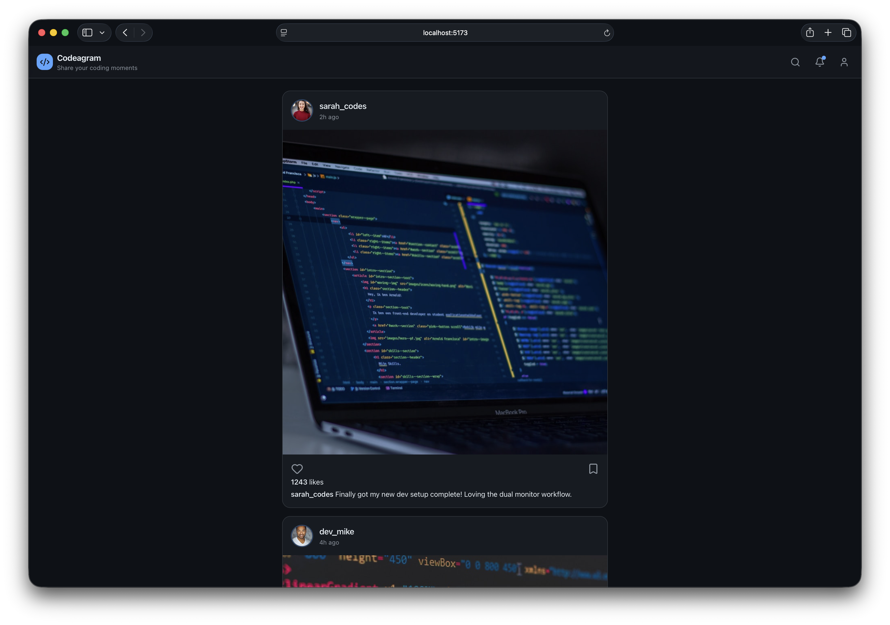
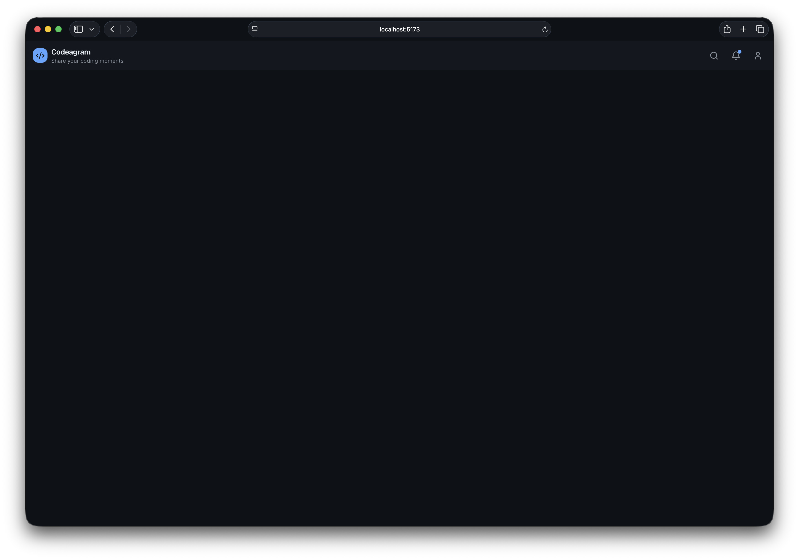

# Codeagram Feed with React Components

---

> **How to work:** Build this on your own, but sit next to someone who can help you if you get stuck.

---

## What You Are Building



You will build a small social feed called **Codeagram** in React.

Your app will include:

1. A sticky header with a brand section and action icons
2. A reusable `PostCard` component
3. A reusable `UserInfo` component inside each post
4. A feed that shows multiple posts
5. Like and bookmark buttons that can change state when clicked

You must create the React project yourself. The styling is already written for you in this guide, so your main focus is React.

## Choose Your Support Level

Use one of these two modes while doing the same exercise:

1. Guided mode (beginner): open all help toggles (`<details>`) and use the starter code.
2. Independent mode (experienced): do the numbered tasks first, and only open the help toggles if you get stuck.

Need help? How to use the toggles:

- Click the triangle or summary text to open help.
- If you are in guided mode, open every help block before coding.
- If you are in independent mode, keep help blocks closed and treat them like backup hints.

---

## 0. Create a New React Project

1. Create a new folder named `codeagram-exercise` on your machine
2. Open that folder in VS Code
3. Open the terminal in VS Code
4. Make sure the terminal is inside the `codeagram-exercise` folder
5. Create the React project directly in the current folder
6. Install `lucide-react`
7. Start the development server

```bash
npm create vite@latest . -- --template react
npm install
npm install lucide-react
npm run dev
```

If Vite asks if you want to continue, type `y`.

### Checkpoint

If setup worked, you should have:

1. A folder named `codeagram-exercise`
2. The React project files created inside that folder
3. A local dev server running
4. A localhost URL in the terminal
5. `lucide-react` installed in the project (check in package.json)

---

## 1. Clean Up the Starter Project

Delete the file `src/App.css`.

### Also clean `App.jsx`

1. Open `src/App.jsx`
2. Remove everything in the file
3. Replace it with this:

```jsx
export default function App() {
  return <main>TODO</main>;
}
```

### Create `src/styles.css`

1. Create a file named `src/styles.css`
2. Open `src/main.jsx`
3. Make sure it imports `./styles.css`

<details>
<summary>Need help? Show starter <code>src/main.jsx</code></summary>

```jsx
import { StrictMode } from "react";
import { createRoot } from "react-dom/client";
import "./styles.css";
import App from "./App.jsx";

createRoot(document.getElementById("root")).render(
  <StrictMode>
    <App />
  </StrictMode>
);
```

</details>

### Checkpoint

The app still runs in the browser without errors.

---

## 2. Add the Styling (Copy-Paste)

Paste this CSS into `src/styles.css`.

```css
:root {
  --page: #0d1117;
  --surface: #161b22;
  --surface-soft: rgba(33, 38, 45, 0.72);
  --border: #30363d;
  --text-strong: #e6edf3;
  --text-muted: #8b949e;
  --icon: #8b949e;
  --accent: #58a6ff;
  --success: #7ee787;

  font-family:
    Inter,
    ui-sans-serif,
    system-ui,
    -apple-system,
    BlinkMacSystemFont,
    "Segoe UI",
    sans-serif;
  color: var(--text-strong);
  background: var(--page);
  font-synthesis: none;
  text-rendering: optimizeLegibility;
  -webkit-font-smoothing: antialiased;
  -moz-osx-font-smoothing: grayscale;
}

* {
  box-sizing: border-box;
}

html {
  background: var(--page);
}

body {
  min-width: 320px;
  min-height: 100svh;
  margin: 0;
  background: var(--page);
}

button,
input,
textarea,
select {
  font: inherit;
}

#root {
  min-height: 100svh;
}

.codeagram-app {
  min-height: 100svh;
  background: var(--page);
}

.app-header {
  position: sticky;
  top: 0;
  z-index: 10;
  display: flex;
  align-items: center;
  justify-content: space-between;
  height: 64px;
  padding: 0 16px;
  border-bottom: 1px solid var(--border);
  background: rgba(22, 27, 34, 0.6);
  backdrop-filter: blur(14px);
}

.brand {
  display: grid;
  grid-template-columns: 32px auto;
  column-gap: 8px;
  min-width: 0;
  color: inherit;
  text-decoration: none;
  align-items: center;
}

.brand-mark {
  display: grid;
  width: 32px;
  height: 32px;
  flex: 0 0 auto;
  place-items: center;
  border-radius: 12px;
  color: #0d1117;
  background: var(--accent);
  grid-row: 1 / span 2;
}

.brand-title {
  display: block;
  color: var(--text-strong);
  font-size: 16px;
  font-weight: 650;
  line-height: 24px;
  letter-spacing: -0.31px;
}

.brand-subtitle {
  display: block;
  color: var(--text-muted);
  font-size: 12px;
  line-height: 16px;
}

.header-actions {
  display: flex;
  align-items: center;
  gap: 12px;
}

.icon-button,
.action-button {
  border: 0;
  color: inherit;
  font: inherit;
  background: transparent;
  cursor: pointer;
}

.icon-button {
  position: relative;
  display: grid;
  width: 36px;
  height: 36px;
  padding: 8px;
  place-items: center;
  border-radius: 50%;
  color: var(--icon);
}

.icon-button.has-dot::after {
  position: absolute;
  top: 6px;
  right: 6px;
  width: 8px;
  height: 8px;
  border-radius: 50%;
  background: var(--accent);
  content: "";
}

.icon-button svg,
.action-button svg {
  display: block;
  width: 100%;
  height: 100%;
  fill: none;
  stroke: currentColor;
  stroke-linecap: round;
  stroke-linejoin: round;
  stroke-width: 2;
}

.icon-button:hover,
.action-button:hover {
  color: var(--text-strong);
  background: var(--surface-soft);
}

.feed {
  display: flex;
  width: min(100%, 672px);
  margin: 0 auto;
  padding: 24px 16px 104px;
  flex-direction: column;
  gap: 16px;
  box-sizing: border-box;
}

.post-card {
  overflow: hidden;
  border: 1px solid var(--border);
  border-radius: 16px;
  background: var(--surface);
}

.user-info {
  display: grid;
  grid-template-columns: 44px minmax(0, 1fr);
  column-gap: 12px;
  min-height: 72px;
  align-items: center;
  padding: 16px;
  box-sizing: border-box;
}

.avatar {
  width: 44px;
  height: 44px;
  flex: 0 0 auto;
  box-sizing: border-box;
  border: 2px solid rgba(88, 166, 255, 0.3);
  border-radius: 50%;
  object-fit: cover;
  grid-row: 1 / span 2;
}

.user-info h2,
.user-info p {
  min-width: 0;
}

.user-info h2 {
  grid-column: 2;
  overflow: hidden;
  margin: 0;
  color: var(--text-strong);
  font-size: 16px;
  font-weight: 550;
  line-height: 24px;
  letter-spacing: -0.31px;
  text-overflow: ellipsis;
  white-space: nowrap;
}

.user-info p {
  grid-column: 2;
  grid-row: 2;
  margin: 0;
  color: var(--text-muted);
  font-size: 12px;
  line-height: 16px;
}

.post-image {
  display: block;
  width: 100%;
  aspect-ratio: 1;
  object-fit: cover;
  background: rgba(33, 38, 45, 0.5);
}

.post-body {
  display: grid;
  grid-template-columns: 24px 1fr 24px;
  column-gap: 16px;
  row-gap: 4px;
  align-items: center;
  padding: 16px;
}

.action-button {
  display: grid;
  width: 24px;
  height: 24px;
  padding: 0;
  place-items: center;
  border-radius: 6px;
  color: var(--icon);
}

.post-bookmark {
  grid-column: 3;
}

.action-button svg.is-active {
  color: var(--accent);
  fill: currentColor;
}

.likes,
.caption {
  grid-column: 1 / -1;
  margin: 0;
  color: var(--text-strong);
  font-size: 14px;
  line-height: 20px;
  letter-spacing: -0.15px;
}

.likes strong,
.caption strong {
  font-weight: 550;
}

.caption {
  overflow-wrap: anywhere;
}

button:focus-visible,
a:focus-visible {
  outline: 2px solid var(--accent);
  outline-offset: 3px;
}

@media (max-width: 520px) {
  .app-header {
    padding: 0 12px;
  }

  .brand-subtitle {
    display: none;
  }

  .header-actions {
    gap: 4px;
  }

  .feed {
    padding: 16px 10px 64px;
  }

  .post-card {
    border-radius: 12px;
  }

  .user-info,
  .post-body {
    padding-right: 12px;
    padding-left: 12px;
  }
}
```

### Styling reminder

In React JSX you use `className`, not `class`.

Examples:

- JSX: `<div className="feed">`
- CSS: `.feed { ... }`
- JSX: `<div className="post-card">`
- CSS: `.post-card { ... }`

### Checkpoint

The project still runs after saving the CSS file.

---

## 3. Create and Test the Header



In this step, you will start with `Header.jsx` so you can see something on the page right away.
Then you will replace placeholders one piece at a time until the full header is finished.

### 3.1 Create the folder

1. In `src`, create a folder named `components`

### 3.2 Create `Header.jsx` first

1. Inside `src/components`, create `Header.jsx`
2. Start with a simple wrapper with the class `app-header`
3. Add temporary placeholder content inside it so you can test the layout early
4. Example placeholder text:
   - `Brand goes here`
   - `Actions go here`
5. Export the component

### Hint

- This is just a test version so you can see the header area early
- You do not need `HeaderBrand` or `HeaderActions` yet
- Search for `.app-header` in `src/styles.css` to see what styling this wrapper gets
- It is okay if the placeholder text looks simple right now

### Mini-checkpoint

Before opening the solution, ask yourself:

1. Did I create `Header.jsx` in the `components` folder?
2. Did I use `className="app-header"`?
3. Did I add some temporary text so I can test the header area?
4. Did I export the component?

<details>
<summary>Need help? Show starter <code>Header.jsx</code></summary>

```jsx
export function Header() {
  return (
    <div className="app-header">
      <div>Brand goes here</div>
      <div>Actions go here</div>
    </div>
  );
}
```

</details>

### 3.3 Test `Header.jsx` in `App.jsx`

Update `src/App.jsx` so it renders only the header for now.

### Hint

- Import `Header` at the top of `App.jsx`
- Keep the wrapper class `codeagram-app`
- Render only one component inside it for now: `<Header />`

### What you should see

- A dark top bar
- The text `Brand goes here`
- The text `Actions go here`

### Placeholder test

Before moving on to `HeaderBrand.jsx`, make sure:

1. The dark header bar is visible
2. Both placeholder texts are visible inside the bar
3. There are no red errors in the editor
4. Saving the file updates the browser

<details>
<summary>Need help? Show temporary <code>App.jsx</code></summary>

```jsx
import { Header } from "./components/Header.jsx";

export default function App() {
  return (
    <div className="codeagram-app">
      <Header />
    </div>
  );
}
```

</details>

### 3.4 Create `HeaderBrand.jsx`

1. Inside `src/components`, create `HeaderBrand.jsx`
2. Build a component that shows:
   - a link
   - a square icon area
   - the text `Codeagram`
   - the text `Share your coding moments`
3. Use the CSS class names from `src/styles.css` to connect your JSX to the styling:
   - `brand`
   - `brand-mark`
   - `brand-title`
   - `brand-subtitle`
4. Import the `CodeXml` icon from `lucide-react`

### Hint

- The outer element should be an `<a>`
- The icon can go inside a `<span>`
- The two text lines can also be inside separate `<span>` elements
- If you are unsure where the styling comes from, search for `.brand` in `src/styles.css`

### Mini-checkpoint

Before opening the solution, ask yourself:

1. Did I import `CodeXml` correctly?
2. Did I use `className`, not `class`?
3. Do I have one outer link wrapping the brand content?

<details>
<summary>Need help? Show starter <code>HeaderBrand.jsx</code></summary>

```jsx
import { CodeXml } from "lucide-react";

export function HeaderBrand() {
  return (
    <a className="brand" href="/">
      <span className="brand-mark">
        <CodeXml size={20} strokeWidth={2} />
      </span>
      <span className="brand-title">Codeagram</span>
      <span className="brand-subtitle">Share your coding moments</span>
    </a>
  );
}
```

</details>

### 3.5 Update `Header.jsx` to use `HeaderBrand`

1. Open `src/components/Header.jsx`
2. Import `HeaderBrand`
3. Replace only the `Brand goes here` placeholder
4. Keep `Actions go here` for now
5. Save and test in the browser

### Hint

- You are only replacing one placeholder in this step
- This helps you test one part at a time
- Your header should still have the `app-header` wrapper

### What you should see

- The Codeagram brand on the left
- The placeholder text `Actions go here` still on the right

### Mini-checkpoint

Before opening the solution, ask yourself:

1. Did I import `HeaderBrand` from the correct file?
2. Did I keep the `app-header` wrapper?
3. Did I replace only the brand placeholder in this step?

<details>
<summary>Need help? Show updated <code>Header.jsx</code> with <code>HeaderBrand</code></summary>

```jsx
import { HeaderBrand } from "./HeaderBrand.jsx";

export function Header() {
  return (
    <div className="app-header">
      <HeaderBrand />
      <div>Actions go here</div>
    </div>
  );
}
```

</details>

### 3.6 Create `HeaderActions.jsx`

1. Inside `src/components`, create `HeaderActions.jsx`
2. Build a component with 3 buttons
3. Use icons for search, notifications, and user/profile
4. Give the notification button the extra class `has-dot`
5. Wrap all 3 buttons in one parent element with class `header-actions`

### Hint

- Import 3 icons from `lucide-react`
- Each icon button should be a real `<button type="button">`
- Each button should use the class `icon-button`
- Only the middle button also gets `has-dot`
- The icon itself goes inside the button

### Mini-checkpoint

Before opening the solution, ask yourself:

1. Do I have exactly 3 buttons?
2. Does each button contain one icon?
3. Did I add `has-dot` only to the notification button?

<details>
<summary>Need help? Show starter <code>HeaderActions.jsx</code></summary>

```jsx
import { Bell, Search, User } from "lucide-react";

export function HeaderActions() {
  return (
    <div className="header-actions">
      <button className="icon-button" type="button">
        <Search />
      </button>
      <button className="icon-button has-dot" type="button">
        <Bell />
      </button>
      <button className="icon-button" type="button">
        <User />
      </button>
    </div>
  );
}
```

</details>

### 3.7 Update `Header.jsx` to use `HeaderActions`

1. Open `src/components/Header.jsx`
2. Import `HeaderActions`
3. Replace `Actions go here` with `<HeaderActions />`
4. Keep `HeaderBrand` in place
5. Save and test in the browser

### Hint

- `Header.jsx` is the component that combines the smaller header parts
- When you finish this step, both placeholders should be gone
- You should now have one wrapper with two child components inside it

### Mini-checkpoint

Before opening the solution, ask yourself:

1. Did I import both components from the correct files?
2. Did I render `<HeaderBrand />` and `<HeaderActions />`?
3. Did I remove the placeholder text?
4. Did I keep the wrapper class `app-header`?

<details>
<summary>Need help? Show starter <code>Header.jsx</code></summary>

```jsx
import { HeaderActions } from "./HeaderActions.jsx";
import { HeaderBrand } from "./HeaderBrand.jsx";

export function Header() {
  return (
    <div className="app-header">
      <HeaderBrand />
      <HeaderActions />
    </div>
  );
}
```

</details>

### Checkpoint

You should now see:

1. A dark top header
2. The Codeagram brand on the left
3. Three icon buttons on the right
4. No placeholder text

---

## 4. Create the Post Data

Create a new folder in `src` named `data`.

Inside `src/data`, create a file named `posts.js`.

### About the data

This file stores the data for the posts in the app.

- `posts` is an array
- An array is a list of values
- Each item in the `posts` array is an object
- An object stores data in `key: value` pairs
- The key is the name of the data
- The value is the actual data

Example:

```js
{
  username: "sarah_codes",
  likes: 1243
}
```

In this object:

- `username` and `likes` are keys
- `"sarah_codes"` and `1243` are values

In this exercise:

- the array is `posts`
- each object is one post
- each post has data like `username`, `image`, `caption`, and `likes`

Add this data:

```js
export const posts = [
  {
    id: 1,
    username: "sarah_codes",
    avatar: "https://images.unsplash.com/photo-1494790108377-be9c29b29330?w=100&h=100&fit=crop",
    timestamp: "2h ago",
    image: "https://images.unsplash.com/photo-1555066931-4365d14bab8c?w=800&h=800&fit=crop",
    caption: "Finally got my new dev setup complete! Loving the dual monitor workflow.",
    likes: 1243
  },
  {
    id: 2,
    username: "dev_mike",
    avatar: "https://images.unsplash.com/photo-1507003211169-0a1dd7228f2d?w=100&h=100&fit=crop",
    timestamp: "4h ago",
    image: "https://images.unsplash.com/photo-1542831371-29b0f74f9713?w=800&h=800&fit=crop",
    caption:
      "Clean code is not written by following a set of rules. You know you are working on clean code when each routine you read turns out to be pretty much what you expected.",
    likes: 2156
  },
  {
    id: 3,
    username: "alex_frontend",
    avatar: "https://images.unsplash.com/photo-1438761681033-6461ffad8d80?w=100&h=100&fit=crop",
    timestamp: "6h ago",
    image: "https://images.unsplash.com/photo-1498050108023-c5249f4df085?w=800&h=800&fit=crop",
    caption: "Just shipped my first React component library to npm!",
    likes: 3421
  },
  {
    id: 4,
    username: "code_wizard",
    avatar: "https://images.unsplash.com/photo-1472099645785-5658abf4ff4e?w=100&h=100&fit=crop",
    timestamp: "8h ago",
    image: "https://images.unsplash.com/photo-1484417894907-623942c8ee29?w=800&h=800&fit=crop",
    caption: "Late night coding session. Working on a new AI feature for my side project.",
    likes: 987
  },
  {
    id: 5,
    username: "julia_dev",
    avatar: "https://images.unsplash.com/photo-1534528741775-53994a69daeb?w=100&h=100&fit=crop",
    timestamp: "10h ago",
    image: "https://images.unsplash.com/photo-1517694712202-14dd9538aa97?w=800&h=800&fit=crop",
    caption: "Coffee + Code = Productivity. Working on some backend optimizations today.",
    likes: 1876
  }
];
```

### Checkpoint

You now have a `posts` array that can be used later in the app.

---

## 5. Build One Reusable Post Card

Start with a simple `PostCard`, test it, and then improve it step by step.

### 5.1 Create a simple `PostCard.jsx`

1. Inside `src/components`, create `PostCard.jsx`
2. Start with a wrapper that uses the class `post-card`
3. Add:
   - one image
   - one caption
4. Use hardcoded content first
5. You can copy one image URL and one caption from `posts.js`, but write them directly inside the component for now

<details>
<summary>Need help? Show simple <code>PostCard.jsx</code></summary>

```jsx
export function PostCard() {
  return (
    <div className="post-card">
      
      <p className="caption">Finally got my new dev setup complete! Loving the dual monitor workflow.</p>
    </div>
  );
}
```

</details>

### 5.2 Test the simple card in `App.jsx`

1. Open `src/App.jsx`
2. Keep the `Header` that you already built and tested in section 3
3. Import `PostCard`
4. Add a wrapper with the class `feed` under the header
5. Render one `PostCard` inside that wrapper
6. Save and test in the browser

<details>
<summary>Need help? Show temporary <code>App.jsx</code> with one simple card</summary>

```jsx
import { Header } from "./components/Header.jsx";
import { PostCard } from "./components/PostCard.jsx";

export default function App() {
  return (
    <div className="codeagram-app">
      <Header />
      <div className="feed">
        <PostCard />
      </div>
    </div>
  );
}
```

</details>

---

### Props

Props are values you send into a component.

- What: props are inputs to a component
- Why: they make a component reusable
- How: you pass props where you use the component, and receive them in the component function

Example:

```jsx
<PostCard image="..." caption="Hello" />
```

```jsx
export function PostCard({ image, caption }) {
  // use image and caption here
}
```

---

### 5.3 Update `PostCard.jsx` to use props

1. Open `src/components/PostCard.jsx`
2. Make the component receive:
   - `image`
   - `caption`
3. Replace the hardcoded image URL with the `image` prop
4. Replace the hardcoded caption text with the `caption` prop

<details>
<summary>Need help? Show <code>PostCard.jsx</code> with props</summary>

```jsx
export function PostCard({ image, caption }) {
  return (
    <div className="post-card">
      
      <p className="caption">{caption}</p>
    </div>
  );
}
```

</details>

### 5.4 Pass props from `App.jsx`

1. Open `src/App.jsx`
2. Pass an image and a caption into `PostCard`
3. Save and test in the browser

<details>
<summary>Need help? Show <code>App.jsx</code> with props</summary>

```jsx
import { Header } from "./components/Header.jsx";
import { PostCard } from "./components/PostCard.jsx";

export default function App() {
  return (
    <div className="codeagram-app">
      <Header />
      <div className="feed">
        <PostCard
          image="https://images.unsplash.com/photo-1555066931-4365d14bab8c?w=800&h=800&fit=crop"
          caption="Learning React step by step"
        />
      </div>
    </div>
  );
}
```

</details>

### 5.5 Render a few more cards with hardcoded props

1. Open `src/App.jsx`
2. Add 2 or 3 more `PostCard` components
3. Give each card its own hardcoded `image` and `caption`
4. Save and test in the browser

<details>
<summary>Need help? Show <code>App.jsx</code> with a few hardcoded cards</summary>

```jsx
import { Header } from "./components/Header.jsx";
import { PostCard } from "./components/PostCard.jsx";

export default function App() {
  return (
    <div className="codeagram-app">
      <Header />
      <div className="feed">
        <PostCard
          image="https://images.unsplash.com/photo-1555066931-4365d14bab8c?w=800&h=800&fit=crop"
          caption="Learning React step by step"
        />
        <PostCard
          image="https://images.unsplash.com/photo-1542831371-29b0f74f9713?w=800&h=800&fit=crop"
          caption="Working on another post card"
        />
        <PostCard
          image="https://images.unsplash.com/photo-1498050108023-c5249f4df085?w=800&h=800&fit=crop"
          caption="Components are getting easier now"
        />
      </div>
    </div>
  );
}
```

</details>

### 5.6 Use the `posts` data

1. Open `src/App.jsx`
2. Import `posts` from `src/data/posts.js`
3. Replace your hardcoded prop values with values from `posts`
4. Use at least 3 posts:
   - `posts[0]`
   - `posts[1]`
   - `posts[2]`
5. Save and test in the browser

<details>
<summary>Need help? Show <code>App.jsx</code> using <code>posts</code> data</summary>

```jsx
import { Header } from "./components/Header.jsx";
import { PostCard } from "./components/PostCard.jsx";
import { posts } from "./data/posts.js";

export default function App() {
  return (
    <div className="codeagram-app">
      <Header />
      <div className="feed">
        <PostCard image={posts[0].image} caption={posts[0].caption} />
        <PostCard image={posts[1].image} caption={posts[1].caption} />
        <PostCard image={posts[2].image} caption={posts[2].caption} />
      </div>
    </div>
  );
}
```

</details>

### 5.7 Create `UserInfo.jsx`

1. Inside `src/components`, create `UserInfo.jsx`
2. Make it receive `avatar`, `timestamp`, and `username` as props
3. Use a `<div>` as the outer wrapper with the class `user-info`
4. Use an `` for the avatar and give it the class `avatar`
5. Use an `<h2>` for the username
6. Use a `<p>` for the timestamp

<details>
<summary>Need help? Show starter <code>UserInfo.jsx</code></summary>

```jsx
export function UserInfo({ avatar, timestamp, username }) {
  return (
    <div className="user-info">
      
      <h2>{username}</h2>
      <p>{timestamp}</p>
    </div>
  );
}
```

</details>

### 5.8 Test `UserInfo.jsx` inside `PostCard.jsx`

1. Open `src/components/PostCard.jsx`
2. Import `UserInfo`
3. Render `UserInfo` above the image
4. Pass hardcoded props into `UserInfo` for now:
   - `avatar="https://images.unsplash.com/photo-1494790108377-be9c29b29330?w=100&h=100&fit=crop"`
   - `username="sarah_codes"`
   - `timestamp="2h ago"`
5. Keep using the `image` and `caption` props in `PostCard`
6. Save and test in the browser

<details>
<summary>Need help? Show <code>PostCard.jsx</code> with hardcoded <code>UserInfo</code></summary>

```jsx
import { UserInfo } from "./UserInfo.jsx";

export function PostCard({ image, caption }) {
  return (
    <div className="post-card">
      <UserInfo
        avatar="https://images.unsplash.com/photo-1494790108377-be9c29b29330?w=100&h=100&fit=crop"
        username="sarah_codes"
        timestamp="2h ago"
      />
      
      <p className="caption">{caption}</p>
    </div>
  );
}
```

</details>

### 5.9 Upgrade `PostCard.jsx` to receive one `post` prop

1. Open `src/components/PostCard.jsx`
2. Change the props from `image` and `caption` to one prop named `post`
3. `post` is an object prop
4. This means you are now passing one object into the component instead of passing separate values one by one
5. Import `UserInfo`
6. Add `UserInfo` above the image
7. Use:
   - `post.avatar`
   - `post.username`
   - `post.timestamp`
   - `post.image`
   - `post.caption`
8. Do not test yet
9. In the next step, update `App.jsx` to match this change

<details>
<summary>Need help? Show upgraded <code>PostCard.jsx</code></summary>

```jsx
import { UserInfo } from "./UserInfo.jsx";

export function PostCard({ post }) {
  return (
    <div className="post-card">
      <UserInfo avatar={post.avatar} timestamp={post.timestamp} username={post.username} />
      
      <p className="caption">{post.caption}</p>
    </div>
  );
}
```

</details>

### 5.10 Update `App.jsx` to pass `post` props

1. Open `src/App.jsx`
2. Replace the `image` and `caption` props with one `post` prop
3. Do this for the same 3 cards
4. Save and test in the browser

<details>
<summary>Need help? Show <code>App.jsx</code> with <code>post</code> props</summary>

```jsx
import { Header } from "./components/Header.jsx";
import { PostCard } from "./components/PostCard.jsx";
import { posts } from "./data/posts.js";

export default function App() {
  return (
    <div className="codeagram-app">
      <Header />
      <div className="feed">
        <PostCard post={posts[0]} />
        <PostCard post={posts[1]} />
        <PostCard post={posts[2]} />
      </div>
    </div>
  );
}
```

</details>

### 5.11 Finish the post card with buttons and likes

1. Open `src/components/PostCard.jsx`
2. Import `useState` from React
3. Import `Heart` and `Bookmark` from `lucide-react`
4. Add two pieces of state:
   - `liked`
   - `bookmarked`
5. Create functions to toggle each state
6. Replace the simple caption area with a wrapper with class `post-body`
7. Add:
   - a like button
   - a bookmark button
   - the likes text
   - the caption text
8. Save and test in the browser

<details>
<summary>Need help? Show completed <code>PostCard.jsx</code></summary>

```jsx
import { useState } from "react";
import { Bookmark, Heart } from "lucide-react";
import { UserInfo } from "./UserInfo.jsx";

export function PostCard({ post }) {
  const [liked, setLiked] = useState(false);
  const [bookmarked, setBookmarked] = useState(false);
  const displayedLikes = liked ? post.likes + 1 : post.likes;

  function toggleLike() {
    setLiked(!liked);
  }

  function toggleBookmark() {
    setBookmarked(!bookmarked);
  }

  return (
    <div className="post-card">
      <UserInfo avatar={post.avatar} timestamp={post.timestamp} username={post.username} />
      

      <div className="post-body">
        <button className="action-button" type="button" onClick={toggleLike}>
          <Heart className={liked ? "is-active" : ""} />
        </button>

        <button className="action-button post-bookmark" type="button" onClick={toggleBookmark}>
          <Bookmark className={bookmarked ? "is-active" : ""} />
        </button>

        <p className="likes">
          <strong>{displayedLikes}</strong> likes
        </p>

        <p className="caption">
          <strong>{post.username}</strong> {post.caption}
        </p>
      </div>
    </div>
  );
}
```

</details>

### Checkpoint

You should now see several complete post cards under the header.

---

## 6. Show Multiple Posts Without `.map()` (Required)

In this part, do **not** use `.map()` yet.

Render multiple `PostCard` components manually in `App.jsx`.

1. Keep `Header`
2. Keep the wrapper with class `feed`
3. Render the first 3 posts one by one:
   - `posts[0]`
   - `posts[1]`
   - `posts[2]`

<details>
<summary>Need help? Show required <code>App.jsx</code> solution without <code>.map()</code></summary>

```jsx
import { Header } from "./components/Header.jsx";
import { PostCard } from "./components/PostCard.jsx";
import { posts } from "./data/posts.js";

export default function App() {
  return (
    <div className="codeagram-app">
      <Header />
      <div className="feed">
        <PostCard post={posts[0]} />
        <PostCard post={posts[1]} />
        <PostCard post={posts[2]} />
      </div>
    </div>
  );
}
```

</details>

### Checkpoint

You should now see a header and 3 post cards in the feed.

---

## 7. Core Tasks (Required)

Complete all of these before you move to the advanced section:

```bash
npm run lint
npm run build
```

1. Project is created from scratch with Vite React
2. `lucide-react` is installed
3. `src/App.css` is removed
4. `src/styles.css` is created and imported
5. `HeaderBrand`, `HeaderActions`, `Header`, `UserInfo`, and `PostCard` are created in separate files
6. `PostCard` uses props
7. `PostCard` uses `useState` for like and bookmark
8. `App.jsx` renders 3 posts without `.map()`
9. `npm run lint` and `npm run build` both pass

---

## 8. Advanced Tasks (For Skilled Students or Anyone Curious)

Choose at least 1.

### 8.1 Refactor the feed to use `.map()`

Now you may use `.map()`.

1. Keep the same `posts` array
2. Replace the 3 manual `PostCard` lines with a `.map()`
3. Use `post.id` as the `key`
4. Try rendering all posts in the array

<details>
<summary>Need help? Show <code>App.jsx</code> with <code>.map()</code></summary>

```jsx
import { Header } from "./components/Header.jsx";
import { PostCard } from "./components/PostCard.jsx";
import { posts } from "./data/posts.js";

export default function App() {
  return (
    <div className="codeagram-app">
      <Header />
      <div className="feed">
        {posts.map((post) => (
          <PostCard key={post.id} post={post} />
        ))}
      </div>
    </div>
  );
}
```

</details>

### 8.2 Add accessibility improvements

1. Make sure all images have `alt` text
2. Add `aria-label` to icon-only buttons

### 8.3 Add one more action button

Examples:

- share
- comment
- send

### 8.4 Pass brand text as props

Try making `HeaderBrand` more reusable by passing in:

- title
- subtitle

---

## 9. Reference

- Main concepts in this exercise: components, props, state, imports, JSX, and optional `.map()`

---

Good luck with the exercise.
